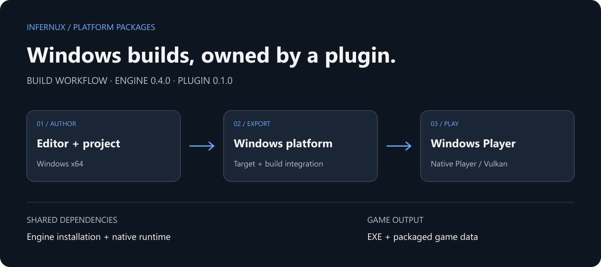

# Windows Platform

Build Windows x64 Players using the native runtime shipped with the Windows engine wheel. This package registers the Windows exporter; it does not contain a second copy of the engine or an entire compiler SDK.

## Before building

A Windows x64 installation of Infernux 0.4.0 with its native Player and Python 3.13 runtime pack. The resulting Player uses Vulkan.

## Host boundary

This is a native-host exporter: Windows builds Windows. Installing this package on Linux does not enable Windows cross-compilation. Disabling or uninstalling it removes its build target.

## Output and troubleshooting

Export a game directory containing its executable, runtime dependencies and packaged game data. Keep the complete output together when distributing it. Project content is cooked into the engine's binary package, not published as the editable Assets/Library tree. Packaging is not DRM.

If the target is absent, check that the package is enabled and the editor is Windows x64. If the build reports missing native Player or Python runtime files, repair the engine installation; reinstalling this small plugin cannot replace those files.
